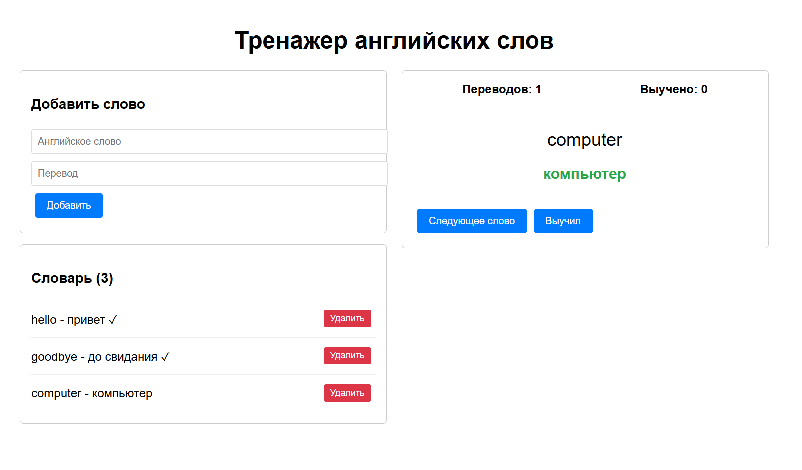

# Тренажер слов

## Описание
Приложение-тренажер для изучения и запоминания иностранных слов. Позволяет пользователям самостоятельно добавлять нужные слова, которые они в дальнейшем смогут выучить.

## Основные возможности
- Добавление новых слов с переводом
- Изучение в карточках
- Отслеживание прогресса обучения
- Удаление ненужных слов

## Примеры работы приложения

На этом скриншоте показан функцианал приложения: добавление и удаление слов, изучение слов в карточке, перевод изучаемых слов.

https://G1eeb.github.io/word-trainer/